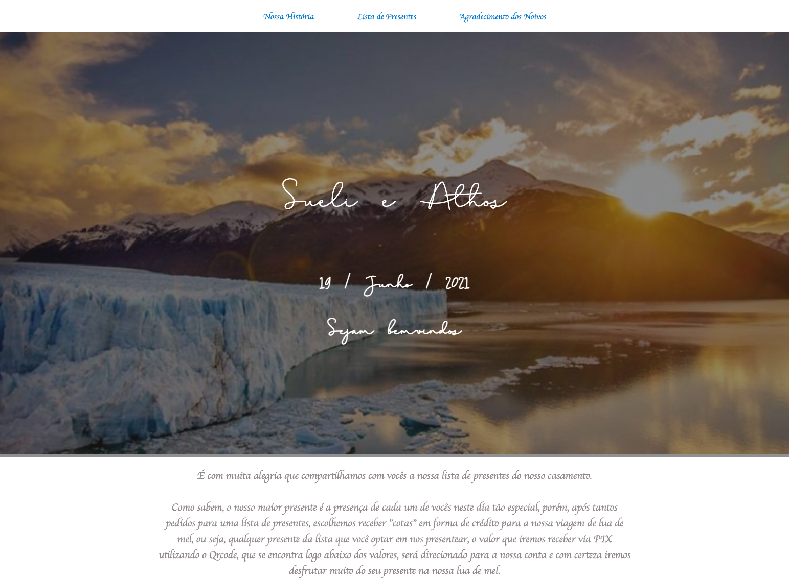
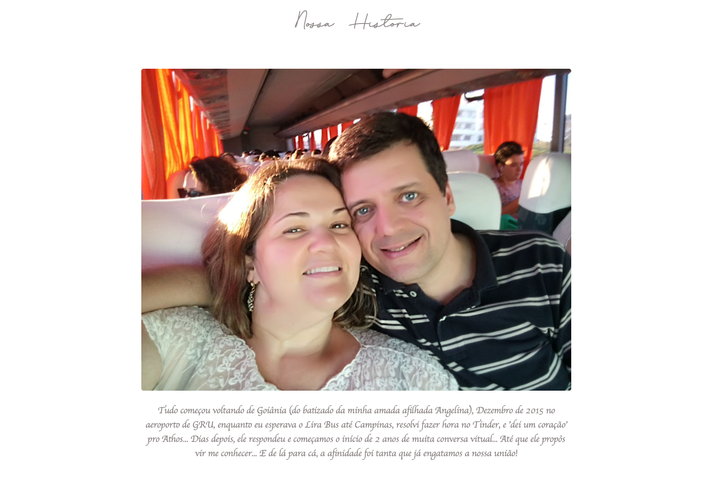
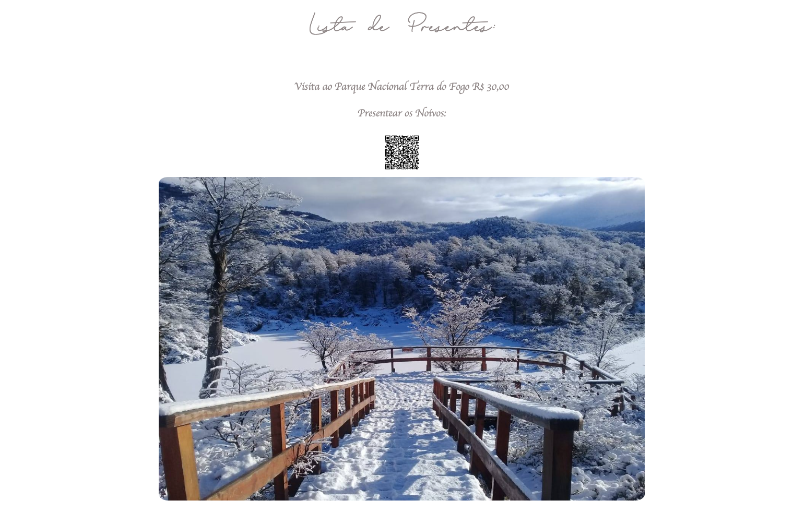
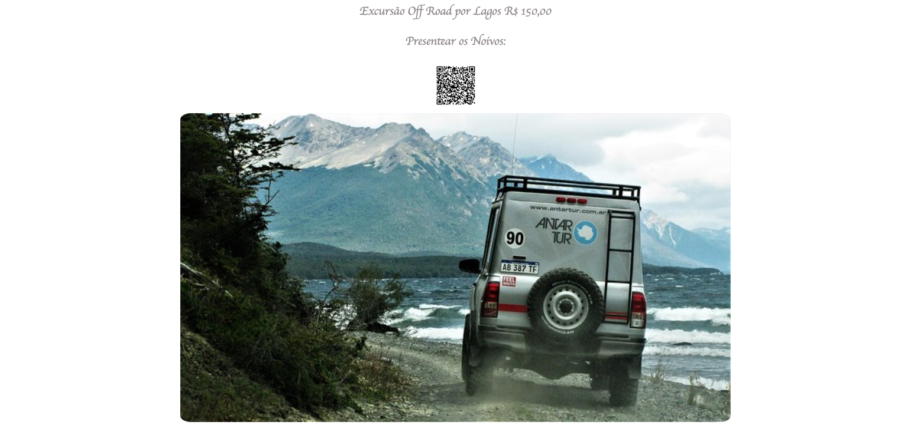
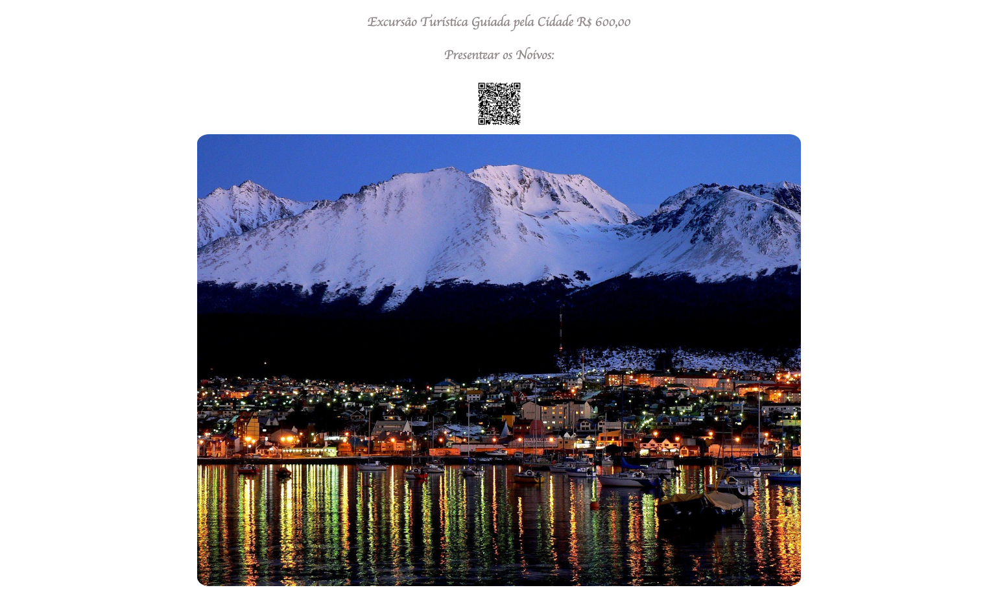
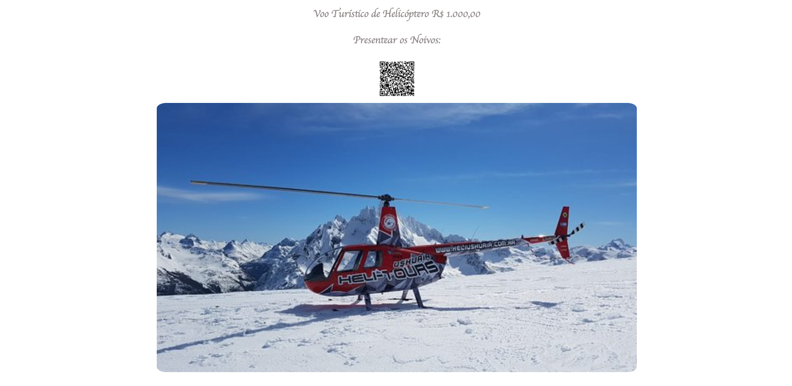
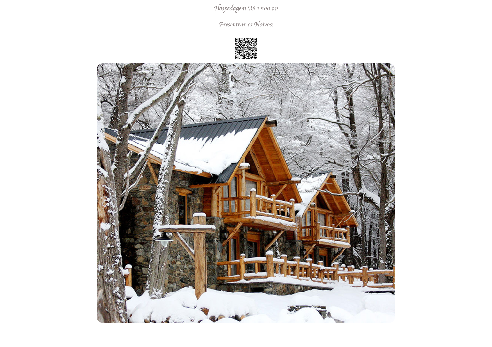
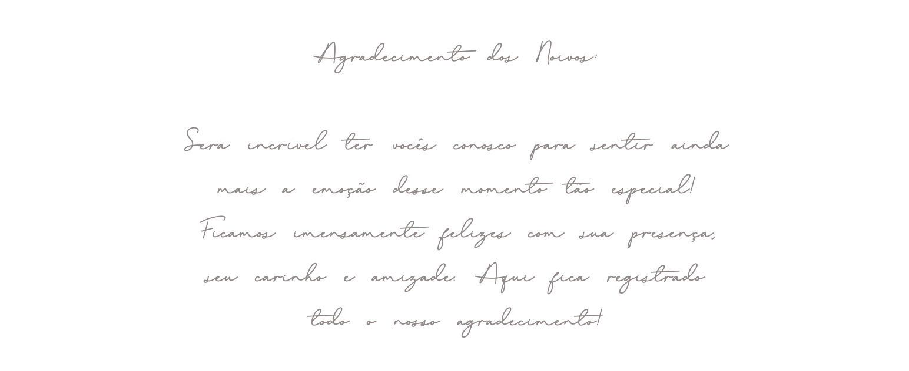

# 
📝 💍 Site lista de presentes para casamento - via PIX
 

👰🏼🤵🏻 Wedding gift list website

📸 Screenshot:

# 🚀 Technologies 

- [HTML](##HTML)
- [CSS](##CSS)
- [JavaScript](##JavaScript)
- [Git e GitHub](##github)

# 👩🏻‍💻 Project 

I made this project for my brother and sister-in-law who were getting married on 06/19/2021, with the aim of raising funds
with this list of wedding gifts, they chose to receive "shares" in the form of credit towards their honeymoon trip.

The way I developed the site with "payment" via PIX, it makes it possible to receive the money without charging fees and also the benefit of receiving the money at the time of the account.

The site raised a little over US$ 3,800.00 (R$ 20,000.00) for the couple, and thus helped a lot on their honeymoon!!! Yeah, long live the bride and groom!!! 🥂🍾

 
🎿⛷🏔🏂❄️⛄️💍
 
 

PT-BR: Fiz esse projeto para meu irmão e minha cunhada que iriam se casar em 19/06/2021, com o objetivo de arrecadar fundos 
com essa lista de presentes de casamento, eles escolheram receber "cotas" em forma de crédito para a viagem de lua de mel deles. 

Da forma que desenvolvi o site com "pagamento" via PIX, possibilida o recebimento do dinheiro sem a cobrança de taxas e também o beneficio de receber o dinheiro na hora em conta. 

O site arrecadou um pouco mais de R$ 20.000,00 (cerca de US$ 3,800.00) para o casal, e assim ajudou em muito na lua de mel deles!!! Sim, viva aos noivos!!! 🥂🍾 

# 
- **[Online project](https://casamento-sueli-and-athos.biancamos.repl.co/)** 

Feito com 🤍 by BM

#
##### 💻 Project delivered to the bride and groom in May 2021
##### 🎯 PT-BR: Projeto entregue aos noivos em Maio de 2021